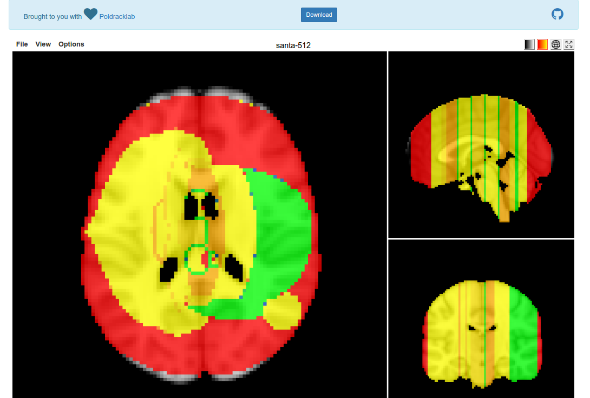

# Artbrain

Draw png images onto brain maps. Inspired by a first go at creating "brainilism" images by rendering tiny brains as pixels, now we want to map an entire image onto a single brain. If you really want to see a [Christmas spirit network](http://www.bmj.com/content/351/bmj.h6266), I think that [we found it](https://vsoch.github.io/artbrain). Currently supports only square PNG images, and contributions to enhance this appreciated!

### Installation

      pip install artbrain

This will place an executable, 'artbrain' in your system folder.

      usage: artbrain [-h] --input IMAGE [--nopreview] [--output-folder OUTPUT]
                      [--port PORT]

      draw png images onto brain maps

      optional arguments:
        -h, --help            show this help message and exit
        --input IMAGE         full path to png image
        --nopreview           don't view output in browser
        --output-folder OUTPUT
                        output folder for html file
        --port PORT           port for preview, if view is True

### Generate an Image

      artbrain --input /home/vanessa/Desktop/santa-512.png

It will open in your browser, and you can download the nifti output file using the blue button. You can adjust the colors by clicking on the overlay tables in the top right, or opening the output image in your viewer of choice and changing the color lookup table. To share with your friends, upload the map to [NeuroVault](http://www.neurovault.org) or put the entire output folder on a web server. 

### The "BEST" image types

Photographs don't come out great- best are graphics with a limited set of colors. The color is converted to an integer value and normalized to a Z score, and transparent pixels are substituted with 0s. It has not been tested fully on every possible image type, but generally these kind of images seem to work best.

### Don't preview it

By default, preview in the browser is set to True. To disable:

      artbrain --input /home/vanessa/Desktop/santa-512.png --nopreview

### Rotate it

By default, we rotate three times (3) to produce an upright image. The preview image in the example was not rotated at all. You can specify how many rotations you want:

      artbrain --input /home/vanessa/Desktop/santa-512.png --rotate 0

### Contributions appreciated!

Would be nice to:

- rotate image
- specify orthogonal view
- do more diabolical things!

